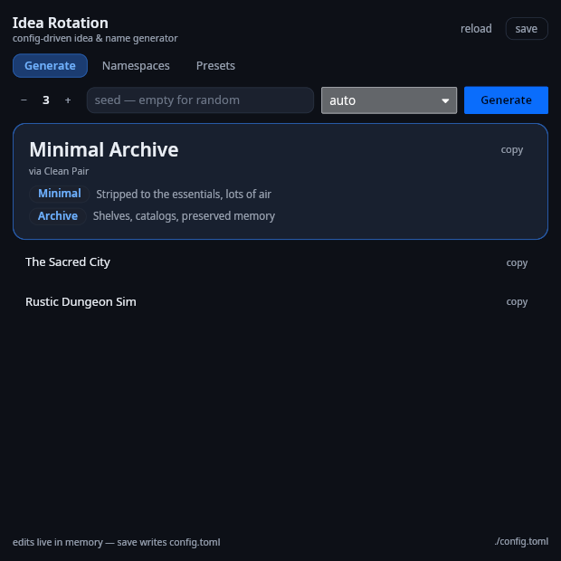

<p align="center">
  
</p>

<h1 align="center">Idea Rotation</h1>

<p align="center">
  <strong>Spin seamless names from your own word pools — GUI, CLI &amp; MCP server in one Rust binary.</strong>
</p>

<p align="center">
  <a href="https://github.com/CyrixJD115/Idea-Rotation/actions/workflows/release.yml"></a>
  <a href="LICENSE"></a>
  
</p>

<p align="center">
  
</p>

## For AI agents

> Install or upgrade Idea Rotation to the latest release: download the archive for this OS from https://github.com/CyrixJD115/Idea-Rotation/releases/latest (Windows `*-windows-x64.zip`, Linux `*-linux-x86_64.tar.gz`, macOS `*-macos-*.zip` matching this machine's arch), extract it, run `idea-rotation init` to create `config.toml`, and verify with `idea-rotation generate --count 2`. Register the MCP server with `idea-rotation mcp` per https://github.com/CyrixJD115/Idea-Rotation/blob/main/install.md#4-register-the-mcp-server, then read SKILL.md in the archive for tool usage. If setup or connection fails, follow https://github.com/CyrixJD115/Idea-Rotation/blob/main/install.md.

## What it is

A **config-driven idea & name generator**. You define *namespaces* (word
pools — each word carries a description of what it evokes) and *patterns*
(name templates). The engine picks words and fuses them into finished
names instead of gluing them with `+`:

```
"{subject} of the {format}"          →  Garden of the Atlas
"{style}{subject}"                   →  CyberBakery
"the {style} {subject} of {material} {format}"
                                     →  the Playful Garden of Obsidian Journal
```

Placeholders take transforms (`.lower` `.upper` `.title` `.cap`), literal
glue text is free-form, and ad-hoc patterns can be passed at runtime
without touching the config. Same seed + same config = same names.

One binary, three faces:

- **GUI** — `idea-rotation` · dark theme, blue accent, compact 3-tab
  interface (Generate / Namespaces / Presets). Every word pool, word, and
  description is editable in-app; **save** writes `config.toml`.
- **CLI** — `idea-rotation generate --pattern "Of The" --seed x --json`
  (patterns by name/index/ad-hoc, `--names-only`, namespace filters).
- **MCP server** — `idea-rotation mcp` · stdio JSON-RPC for AI agents:
  `generate_ideas`, `list_namespaces`, `get_config` to read, plus
  `add_namespace` / `add_option` / `set_namespace_enabled` so agents can
  build word pools straight into the config and roll names from them in
  the same session.

## Install

Grab a prebuilt binary from the
[latest release](https://github.com/CyrixJD115/Idea-Rotation/releases/latest)
(`.exe` for Windows, `.tar.gz` + `.AppImage` for Linux, `.app` for macOS),
then:

```sh
idea-rotation init          # create config.toml
idea-rotation generate      # roll your first names
idea-rotation               # open the GUI
```

Full step-by-step (all OSes, MCP registration, troubleshooting):
**[install.md](install.md)** · Agent/usage reference: **[SKILL.md](SKILL.md)**

## Config

Everything lives in one TOML file — redefine the generator without
touching code:

```toml
[[namespaces]]
id = "style"
name = "Style"
description = "The aesthetic flavor."

  [[namespaces.options]]
  word = "Cyber"
  description = "Neon, high-tech, chrome futurism"

[[patterns]]
name = "Of The"
template = "{subject} of the {format}"

[[presets]]
name = "Brainstorm"
enabled = ["style", "subject", "format"]
```

## Build from source

```sh
cargo test                    # 26 unit tests
cargo build --release         # → target/release/idea-rotation
```

Rust + [Iced](https://iced.rs) 0.13. Noto Sans fonts (OFL) and the window
icon are embedded — one binary, no runtime asset files.

```
src/config.rs   model, TOML load/save, defaults, sanitize
src/engine.rs   pattern parsing + seeded generation
src/mcp.rs      MCP stdio server (pure core + IO loop)
src/gui.rs      Iced GUI
src/theme.rs    dark/blue design system
assets/         embedded fonts (OFL) + icon
```

## License

[GPL-3.0](LICENSE) · fonts under OFL (see `assets/fonts/`).
